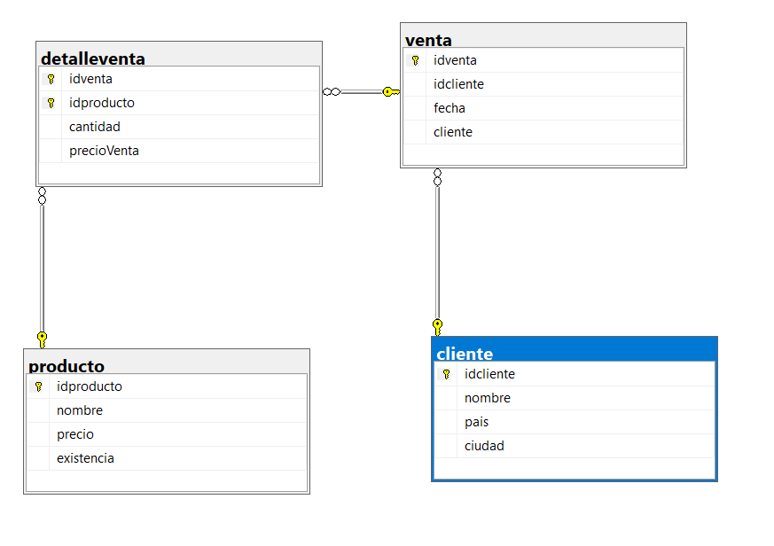
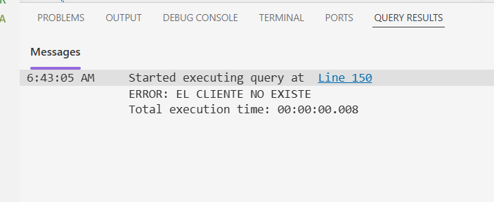

# `EJERCICIO DE UN SP`

## Instrucciones y requerimientros:

CREAR UN STORED PROCEDURE QUE: 
 registre una venta 
- 1.- manejo de errores y transacciones 
- 2.- inserten venta, que incluya la fecha actual y el cliente que la realizo, (verificar si el cliente existe el cliente)
- 3.- registrar el detalle con solo un producto (verificar y el producto existe) deber de obtener el precio actual del producto para insertarlo en detalle de venta,tambien se debe de verifiacar que el producto tenga suficiente existencia*
- 4.- Actualizar la existencia de la cantidad de vendida

> Creacion de la **Base de datos**
```SQL
CREATE DATABASE bd_Actividad;
GO
USE bd_Actividad; 
GO
```
> Creación e inserción de la tabla **CLIENTE** 
```SQL
CREATE TABLE cliente (
    idcliente NCHAR(5) PRIMARY KEY,
    nombre NVARCHAR(100),
    pais NVARCHAR(50),
    ciudad NVARCHAR(50)
);
GO

INSERT INTO bd_Actividad.dbo.cliente (idcliente, nombre,pais,ciudad)
SELECT [CustomerID], [CompanyName], [Country], [City]
FROM NORTHWND.dbo.customers;
GO
```
> Creacion e insercion de la tabla **PRODUCTOS**
```sql
CREATE TABLE producto (
    idproducto INT PRIMARY KEY,
    nombre NVARCHAR(100),
    precio DECIMAL(10,2),
    existencia INT
);

INSERT INTO bd_Actividad.dbo.producto (idproducto, nombre, precio, existencia)
SELECT [ProductID], [ProductName], [UnitPrice], [UnitsInStock]
FROM NORTHWND.dbo.products;
```

>Creación de la tabla **VENTA**
```sql
CREATE TABLE venta (
    idventa INT PRIMARY KEY IDENTITY(1,1),
    idcliente NCHAR(5),
    fecha DATETIME,
    cliente NVARCHAR(100),
);
```
>Creación de la tabla **DETALLE DE VENTA**
```sql
CREATE TABLE detalleventa (
    idventa INT,
    idproducto INT,
    cantidad INT,
    precioVenta DECIMAL(10,2),

    CONSTRAINT PK_detalleventa 
    PRIMARY KEY (idventa, idproducto)
);
```
## DIAGRAMA DE LA BASE DE DATOS FINALIZADA



## CREACION DEL *STORED PROCEDURE* 🦁
```SQL

CREATE OR ALTER PROC usp_insertarVenta
    @idcliente NCHAR(5),
    @idproducto INT,
    @cantidad INT
AS
BEGIN

    IF LEN(@idcliente) > 5
    BEGIN
        PRINT 'ERROR: EL ID DEL CLIENTE DEBE SER DE 5 CARACTERES';
        RETURN;
    END

    IF NOT EXISTS (SELECT 1 FROM cliente WHERE idcliente = @idcliente)
    BEGIN
        PRINT 'ERROR: EL CLIENTE NO EXISTE';
        RETURN;
    END

    IF NOT EXISTS (SELECT 1 FROM producto WHERE idproducto = @idproducto)
    BEGIN
        PRINT 'ERROR: EL PRODUCTO NO EXISTE';
        RETURN;
    END

    DECLARE @existencia INT;
    DECLARE @precio DECIMAL(10,2);
    DECLARE @idventa INT;

    SELECT 
        @existencia = existencia,
        @precio = precio
    FROM producto
    WHERE idproducto = @idproducto;

    IF @existencia < @cantidad
    BEGIN
        PRINT 'ERROR: EXISTENCIA INSUFICIENTE';
        RETURN;
    END

    BEGIN TRY

        BEGIN TRANSACTION;

        INSERT INTO venta (idcliente, fecha)
        VALUES (@idcliente, GETDATE());

        SELECT @idventa = SCOPE_IDENTITY();

        SELECT SCOPE_IDENTITY() AS [UltimoId];

        INSERT INTO detalleventa (idventa, idproducto, cantidad, precioVenta)
        VALUES (@idventa, @idproducto, @cantidad, @precio);

        UPDATE producto
        SET existencia = existencia - @cantidad
        WHERE idproducto = @idproducto;

        COMMIT;

        PRINT 'VENTA REGISTRADA';

    END TRY
    BEGIN CATCH

        IF @@TRANCOUNT > 0
            ROLLBACK;

        PRINT 'ERROR EN LA TRANSACCIÓN';
        PRINT ERROR_MESSAGE();

    END CATCH
END;
```
## EJECUCIONES 

```sql
EXEC usp_insertarVenta 
 @idcliente = 'ALFKI', 
 @idproducto = 1,
 @cantidad = 2;

 EXEC usp_insertarVenta  
 @idcliente = 'PERIC',
  @idproducto = 22,
  @cantidad = 66;

```
> cuando el cliente no existe
```sql
EXEC usp_insertarVenta 
@idcliente = 'ZZZZZ',
@idproducto = 1,
@cantidad = 2;
```


